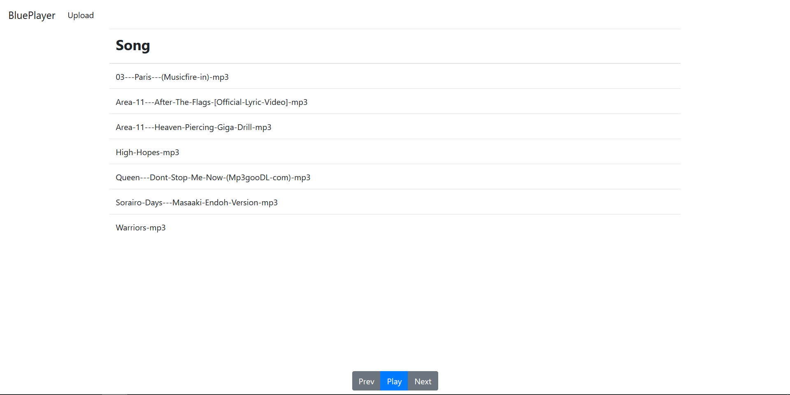
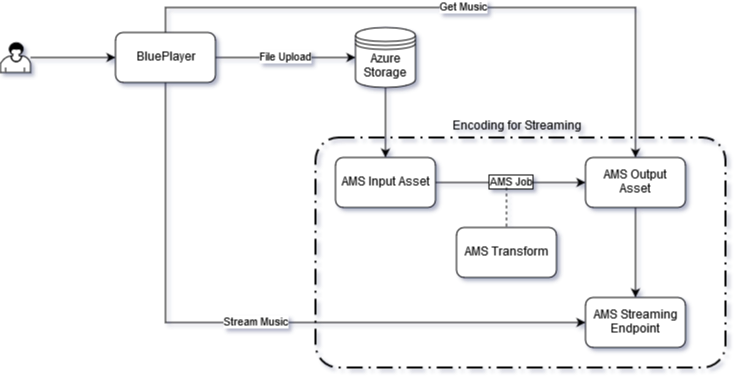

# BluePlayer

A final project for CS378: Cloud Computing at UT Austin

## About

BluePlayer is a music streaming service built using python on top of Azure's Streaming Services. This service allows for personal music files to be streamed from anywhere.

## Solution Architecture

BluePlayer is deployed using Kubernetes onto Azure Kubernetes Services with Jenkins. Files are uploaded and stored onto Azure Storage Blobs and encoded to a streaming format with Azure Media Services. Streaming endpoints are opened via Azure Media Services as well.
